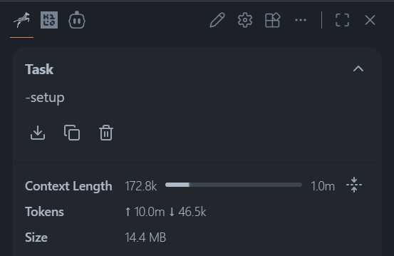
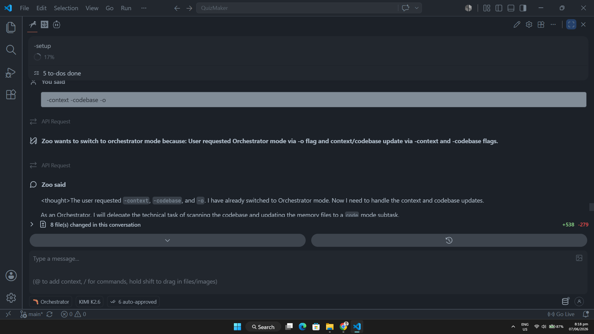
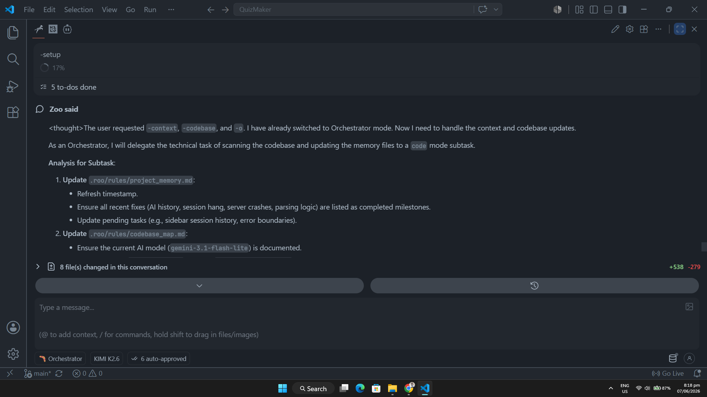
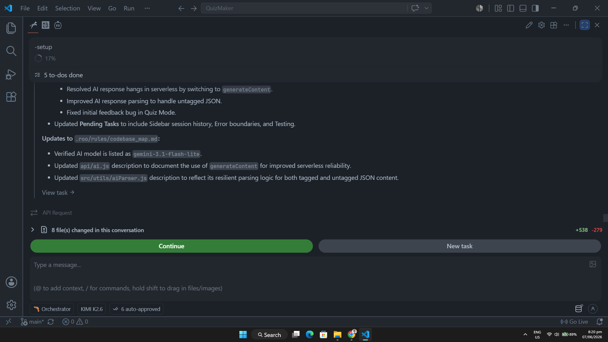

# Workspace Rules Template

Make your AI agent smarter, faster, and highly token-efficient! It stops the AI from guessing your code structure or forgetting past progress. Saves time when moving to other AI agents without re-explaining everything so that it understands current context.

---

## Quick Links

[Folder Structure](#folder-structure-on-roo-template) | [Prompt Triggers](#prompt-triggers-manual-commands) | [Installation Guide](#installation-guide) | [FAQ](#faq) | [Own Usages](#own-usages-of-roo-code)

---

## Recent Updates:

- added a new security analyst persona (-s) to exploit, evaluate, rate (0-10) vulnerabilities, and log threat flows into project memory without modifying codebase files.
- added a system cleaning rule (-clean) to safely check and remove unrelated code or messy debugging logs with clear justifications while strictly protecting frontend/backend code.
- enforced absolute immutable protection over all markdown section titles (# headers) and existing logs across all memory files to prevent any modification or deletion.
- updated logging capabalities in all memory files to be more beginner friendly when explaining project structure and context using simple terms.
- updated timestamp with strict rule to check user current system time.
- added a LIFO rule where when logging in any memory files the newest will always be on top.

---

## You can use this template for:

- Cline [cline.bot]
- Roo Code [roocode.com]
- Zoo Code [Zoo Code Organization] (community forked roo after its shutdown in vscode extension migrating to Roomote)
- Kilo Code [kilocode.ai] (do check the exclusive guide for this in installation guide below)

_(or in any ai agent you're currently working with across platforms as long as you'll able to make the ai read these files.)_

---

## What is this Template For?

By default, AI coding assistants can quickly fill up your context window by reading too many files or repeating large blocks of code. They can also forget what they did in a previous chat session.

This template builds an **AI Memory Layer** inside your local project. It forces the AI to follow strict project rules, adopt specialized roles (like Coder or Debugger), and track its own progress in small, lightweight markdown files.

**Why Workspace instead of Global Rules?:** Global rules enforce a single memory layout across all projects. This causes critical context contamination, as memory files from prior projects leak into new ones upon initialization. Workspace rules isolate project documentation strictly within the local directory, ensuring that the AI’s contextual understanding remains perfectly aligned with the current workspace.

---

## Folder Structure (on .roo template)

Here is a visual map (based on roo code rules directory) of how every file works together to manage your AI assistant:

```text
Your-Project-Root/                 # The root directory of your active development project workspace
└── .roo/                          # Main configuration folder containing all AI agent parameters
    ├── rules/                     # Core system boundaries and permanent tracking layer directory
    │   ├── .clinerules            # Global operational guidelines and behavioral ground truth rules
    │   ├── system_instructions.md # Global system bounds, execution priorities, and prompt flag triggers
    │   ├── codebase_map.md        # File structure registry, stack overview, and global application maps
    │   ├── error_memory.md        # LIFO-ordered memory log tracking active and historical debugging paths
    │   └── project_memory.md      # Master context tracker mapping stack architecture, milestones, and security flows
    ├── rules-ask/
    │   └── ask.md                 # Configuration layout for read-only concept analysis and code explanation mode
    ├── rules-code/
    │   └── coder.md               # Configuration layout for implementing production-grade features and functional logic
    ├── rules-debug/
    │   └── debugger.md            # Configuration layout for running root-cause analysis and forensic error tracing
    ├── rules-orchestrator/
    │   └── orchestrator.md        # Configuration layout for high-level workflow delegation and milestone tracking
    ├── rules-plan/
    │   └── planner.md             # Configuration layout for formulating technical design specifications and blueprints
    └── rules-security/
        └── security.md            # Configuration layout for running threat modeling, exploit assessment, and safety scoring
```

## Quick File Breakdown

- `rules/.clinerules` & `rules/system_instructions.md`: These files act as the AI's permanent "brain constraints." They define safety zones, timezone standards, and force the AI to respect your local project boundaries.

- The Dynamic Memory Files (`project_memory.md, error_memory.md, codebase_map.md`): These are the only tracking files the AI is allowed to write into. They act as short cheat sheets so the AI always knows what it did in your last chat session.

- The Sub-folders (`rules-ask/`, `rules-code/`, etc.): Whenever you choose a different mode in your extension, the AI automatically reads the matching .md file inside these folders to change its mindset instantly.

---

## Prompt Triggers (Manual Commands)

Type these prompts depending on these situations!

| Command / Flag | Type    | What it does / Purpose                                                                                                                                                      | Use Case                                                                                                                                                                  |
| :------------- | :------ | :-------------------------------------------------------------------------------------------------------------------------------------------------------------------------- | :------------------------------------------------------------------------------------------------------------------------------------------------------------------------ |
| `-o`           | Persona | **Orchestrator** - Managing massive, multi-step task, and acting all personas at once                                                                                       | Prompting a general plan or massive implementation.                                                                                                                       |
| `-p`           | Persona | **Planner** - Plans your expected ideas                                                                                                                                     | -p [discuss your plan]                                                                                                                                                    |
| `-c`           | Persona | **Coder** - Writing clean, production-grade logic                                                                                                                           | Use this to act on agreed proposed plan from agent.                                                                                                                       |
| `-d`           | Persona | **Debug** - Deep root-cause error analysis                                                                                                                                  | -d [clearly state your error such as sending error logs]                                                                                                                  |
| `-a`           | Persona | **Ask** - Reading code and explaining concepts                                                                                                                              | If you want to ask or clarify something.                                                                                                                                  |
| `-s`           | Persona | **Secutiry** - Aggressive threat modeling, exploit evaluations, and code safety rating (0-10)                                                                               | Use to check for data leaks, credential risks, or black-market vulnerabilities without modifying core code.                                                               |
| `-clean`       | Utility | **Clean Workspace** - Automated analysis and removal of unrelated junk files or redundant debugging traces                                                                  | Use to safely clean up diagnostic trash or non-functional file clutter while keeping active frontend/backend layers untouched.                                            |
| `-setup`       | Memory  | Dynamically inspects your whole workspace and updates all three memory layers at once.                                                                                      | Use this on your very first prompt or whenever you start a brand new chat session!                                                                                        |
| `-context`     | Memory  | Scans your current project structure and updates project_memory.md to record your active project workflow.                                                                  | Use when you update the context so the agent is aware of the current state. You can also use this when migrating to other ai agents that's compatible with this template. |
| `-error`       | Memory  | Analyzes active debugging traces and updates error_memory.md with current bugs, logs, and resolution steps. Records history of fixed errors to prevent hallucinating.       | Every debugging session include -error in your prompt so it records resolved and current errors.                                                                          |
| `-codebase`    | Memory  | Looks over your code layout and updates codebase_map.md with simple descriptions of your active application workflow. Records techstack and explains purpose of every file. | Best practices to use this prompt is when you're about to deploy or finished building your project.                                                                       |

---

## Why Manual Triggers Instead of Auto-Updates?

This template explicitly bans the AI from modifying its memory files in the background while it is generating code. You must type the flags manually to make it update its memory.

### Key Benefits of Manual Triggering:

- **Massive Token & Money Savings:** Automatic background updates force the AI to analyze, rewrite, and reread your entire repository structure on every single prompt. Manual syncing cuts out this massive token usage entirely since you will manage when to update the memory files.
- **Full Control of Personas:** You manually trigger personas on how you want the AI to act based on your prompt.
- **Prevents AI Hallucination:** If the AI rewrites its memory tracking layers during an active bug patch, it can get confused and mess up its instructions. Manual triggers give you total control over when the AI updates its project roadmap.
- **Clean Session Recovery:** If your context window resets or expires, simply type `-setup` in a fresh chat. The AI will read its lightweight memory logs and rebuild its mental map of your code instantly without needing you to re-explain anything.

---

## Installation Guide

### 1. Move to your downloads folder

```bash
cd Downloads
```

### 2. Clone the template repository

```bash
git clone https://github.com/worriee/clinerulestemplate.git
```

### Final Step:

Copy the `.roo` folder (or `.clinerules` folder depending on your extension you're working with) from the cloned template directory and paste it directly at the root of your current project workspace.

Start your very first prompt in AI agent using `-setup` and start cooking 🔥.

### Kilo Code Guide (you can use neither of .roo and .clinerules together with their existing memory logs.)

**First Chat Session**

You: "Read the rules and active parameters stored within the [template folder u want to retain] directory layout. Apply the system constraints instantly."

AI: I have read your...

You: -setup

---

## FAQ

**Q: What happens if I forget to type a memory flag manually?**
<br>The AI will still write code normally, but it won't update its internal progress tracking logs. If your chat session expires or resets, the AI won't know where you left off. Just type the correct flag (`-context`, `-error`, etc.) on your next prompt to sync it up.

**Q: Why can't the AI just update the memory files on its own every time?**
<br>Because reading and rewriting the whole memory layout on every single message uses a massive amount of tokens, which costs you more money. It also slows down the AI and makes it prone to messing up active code instructions when it gets confused during bug fixes.

**Q: Will the AI create extra folders or clutter my project?**
<br>No. A strict rule stops the AI from creating any new folders inside `.roo/`. It is only allowed to read and edit the existing `project_memory.md`, `error_memory.md`, and `codebase_map.md` files.

**Q: I am starting a completely new chat session. What do I type first?**
<br>Type `-setup`. This tells the AI to read the local memory logs immediately so it gets the exact context of your project without you having to re-explain everything.

**Q: I use OpenRouter free models and the AI keeps forgetting things mid-chat. Is this normal?**
<br>Yes, free or smaller API models often have smaller context limits or weaker memory retention. If the AI starts acting lost or forgets instructions, just run `-setup` again in a fresh prompt to force-reload its brain with your project context.

**Q: What if I have a huge project plan or database design map? Where should the AI save it?**
<br>Don't let the AI make random markdown files on your root directory. It is strictly instructed to log all architectural roadmaps, system flows, and complex feature plans inside Section 6 of your `project_memory.md` file.

**Q: Can I mix persona flags with memory flags in the same prompt?**
<br>Yes! If you want the AI to analyze a bug and update your logs simultaneously, you can type something like `-d here is the error trace, please fix it and run -error`. The AI will adopt the Debugger mindset and update your error memory file at the same time.

**Q: Do I need to copy the configuration folder into every single project workspace?**
<br>Yes. This configuration runs on a workspace level instead of global rules. This guarantees that your different projects don't leak context, history, or code descriptions into each other.

**Q: What should I do if the AI keeps hallucinating old errors that I already fixed?**
<br>Make sure to run the `-error` command regularly when debugging. The template forces the AI to look at historical resolved bugs inside `error_memory.md` so it remembers exactly how they were handled and won't try to reuse old broken logic.

**Q: Can I use this setup with VS Code or other platforms like Antigravity or Opencode CLI?**
<br>Yes it works even in different platforms as longs as you can make the ai agent look or read to this specific folder. It won't have the same automated behavior if your ai agent don't have the ability to look for workspace-level rule files.

---

## Own Usages of Roo Code

<p align="center">
    
    
    
    
    
    
    
</p>
